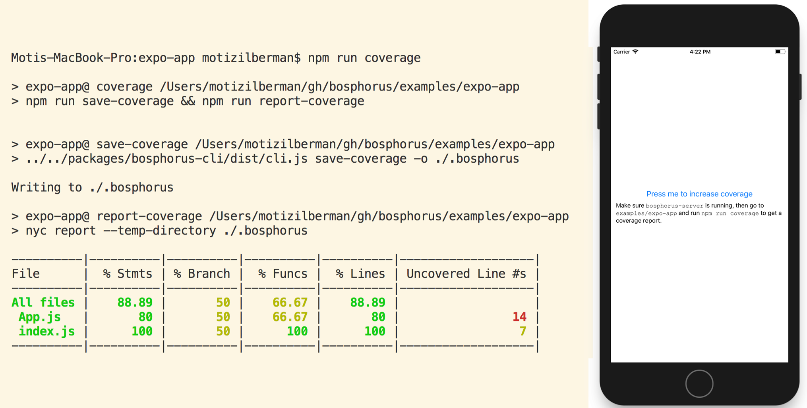
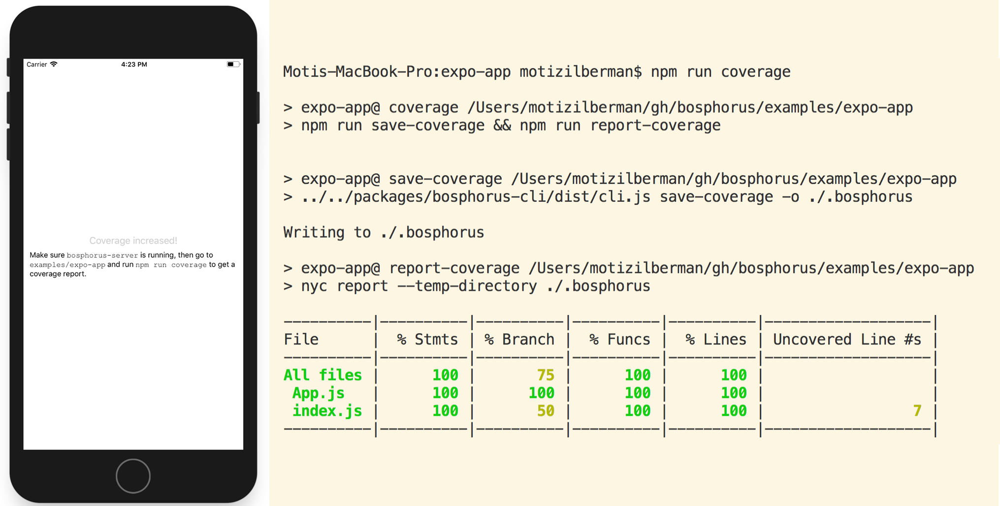
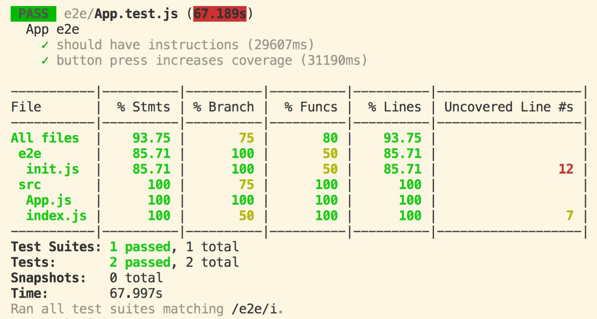

# bosphorus + Expo + Jest + Detox

This example showcases the following features of Bosphorus:

1.  Generating coverage reports on demand from a running React Native app, built with [Expo](https://expo.io/).
2.  Integrating with [Detox](https://github.com/wix/detox) and [Jest](https://facebook.github.io/jest/) to produce a combined coverage report from end-to-end tests running in a simulator.

## Basic setup

* The app is instrumented with [`babel-plugin-istanbul`](https://github.com/istanbuljs/babel-plugin-istanbul), which collects coverage data in a global variable within the app, called `__coverage__`. This is configured in [`.babelrc`](https://github.com/motiz88/bosphorus/blob/master/examples/expo-app/.babelrc).
* The app calls [`startCoverageClient()`](https://github.com/motiz88/bosphorus/blob/cabb24206d2c5e7316162b27a605cca0579ae0ff/examples/expo-app/src/index.js#L5) (from [`bosphorus-client`](https://github.com/motiz88/bosphorus/tree/master/packages/bosphorus-client)) on startup. By default, this expects to find [`bosphorus-server`](https://github.com/motiz88/bosphorus/tree/master/packages/bosphorus-server) running at `http://localhost:8123`.

`bosphorus-cli` can be used for interactive coverage reporting, while `bosphorus-jest` can add coverage data from a remote test suite to reports produced by Jest. These scenarios are detailed below.

## Interactive coverage reporting

At any given time while the app is running, [`bosphorus-cli`](https://github.com/motiz88/bosphorus/tree/master/packages/bosphorus-cli) can request a JSON snapshot of the coverage data from the server, which can then be consumed by the standard IstanbulJS reporting tools. An example of doing both is provided as `npm run coverage` in this package.

Try running `npm run coverage` before and after pressing the button to see the coverage change:

### Before

### After

## Jest + Detox integration

A Detox test suite is configured, using Jest as the test runner. Check out [expo/with-detox-tests](https://github.com/expo/with-detox-tests/) for prerequisites and usage instructions (see also [wix/detox#630](https://github.com/wix/detox/pull/630/files)).

> ⚠️ Due to the size of the included Expo binary, you will need to use [Git LFS](https://git-lfs.github.com/) when cloning this repository in order to run the Detox test suite.

The `npm run test:e2e:ios` command assumes that Expo (`exp start`) and `bosphorus-server` are both running.

After each test, `bosphorus-jest` (configured in Jest's `setupTestFrameworkScriptFile`) pulls the coverage data from the app and merges it into the Jest process's own `__coverage__` global. This is sufficient for Jest's built-in coverage reporter (CLI: `--coverage` / API: `collectCoverage`) to do the rest.

